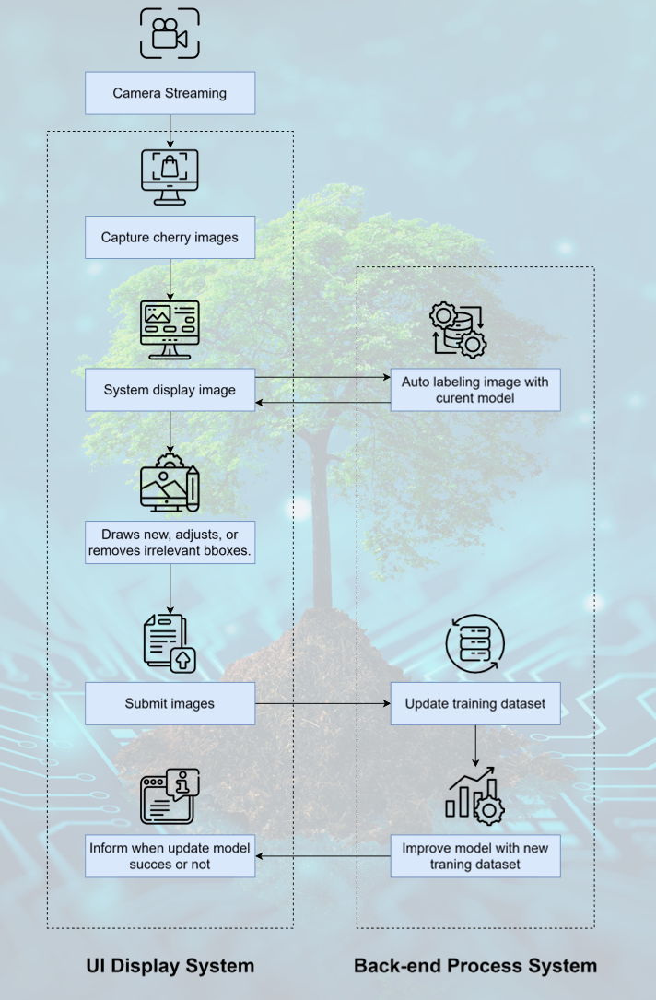
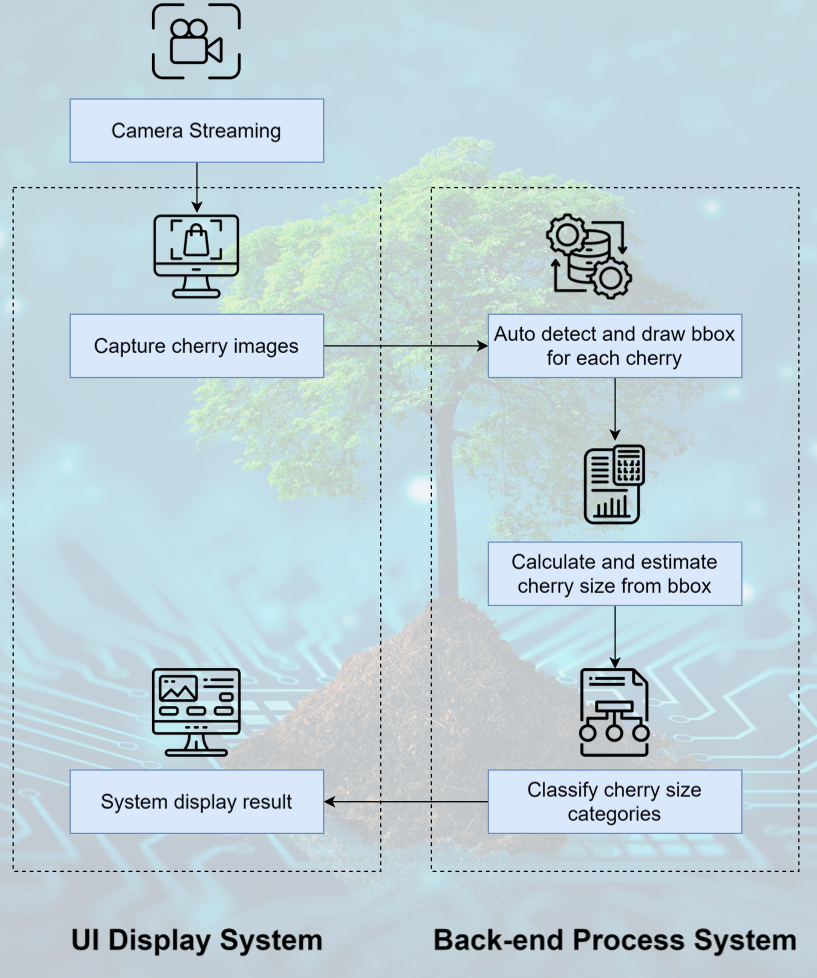
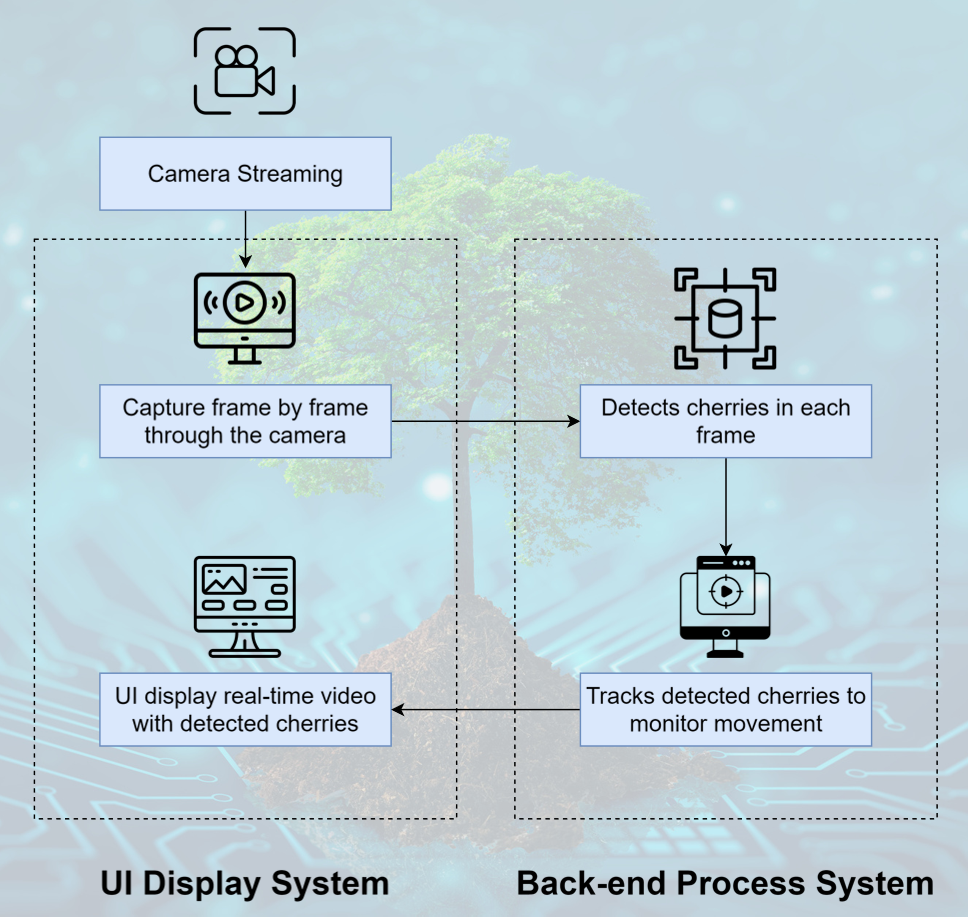
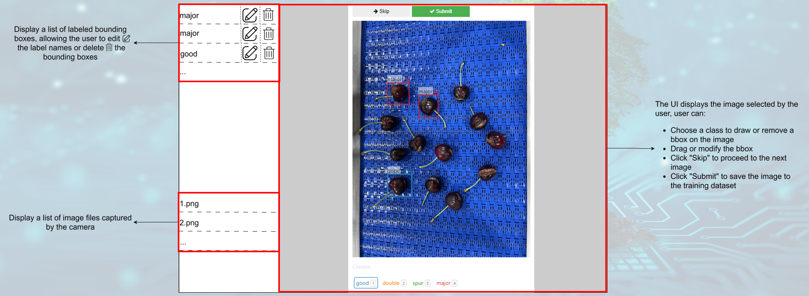
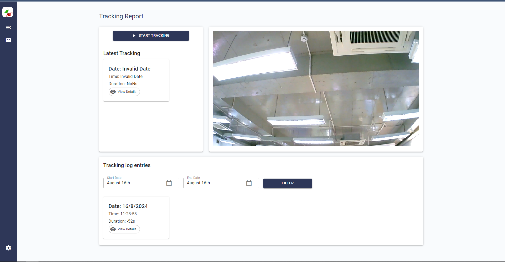
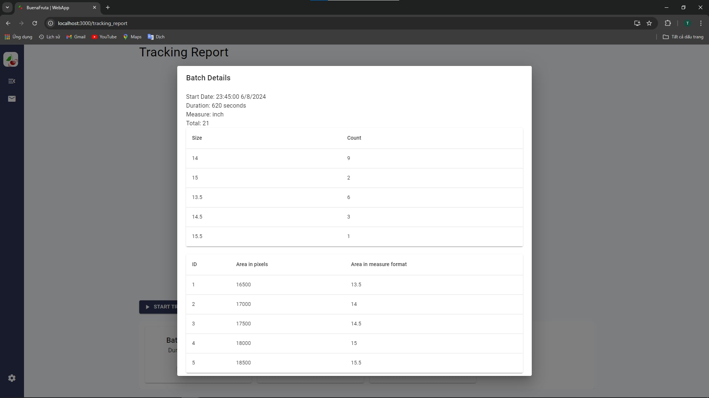

# Introduction
Built a system to automate the labeling, training, and tracking of cherry images, enabling efficient detection and classification of cherry error types. The project aimed to improve accuracy and scalability in cherry quality assessment using advanced computer vision and cloud technologies.

# Step By Step

| Image Capturing and Labeling for Cherries | Size Estimation of Cherries on Conveyor | Cherry Tracking on Conveyor |
|---------|---------|---------|
|  |  |  |

**UI Display for Labeling**

# Result

 

# Contribute
* **An Pham** - Data Engineer - [AnNePDHA](https://github.com/AnNePDHA)
  * Extracted and transformed cherry data using ETL processes in Python, ensuring clean and structured datasets for model training
  * Utilized Azure services for data training and storage, including Azure Machine Learning for model training, Azure Storage Account for data management, and Azure Bus Services for efficient data communication
  * Managed CI/CD pipelines and version control using Azure DevOps, ensuring smooth deployment and updates of the system.
